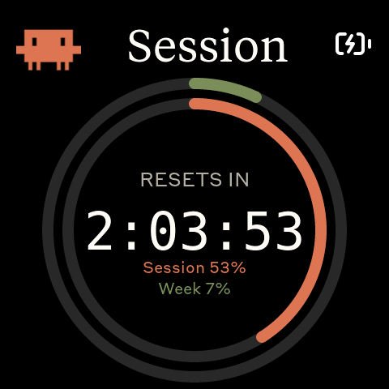
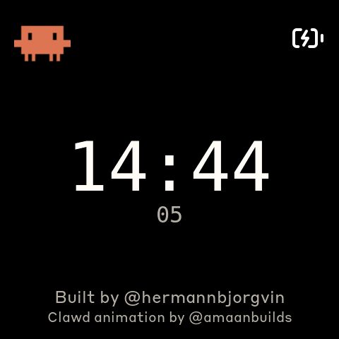
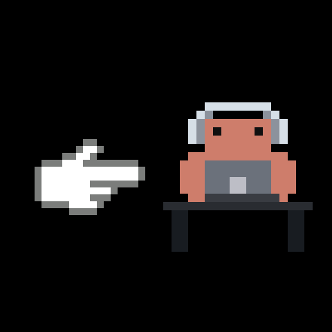

# DeskPet

A desk-side pet that monitors your Claude Code usage on a 480×480 AMOLED screen — and nudges you when you slack off.

It runs on a [Waveshare ESP32-S3-Touch-AMOLED-2.16](https://www.waveshare.com/esp32-s3-touch-amoled-2.16.htm?&aff_id=149786), pairs with your laptop over Bluetooth, and plays pixel-art Clawd animations that match your coding intensity. The two side buttons send keyboard shortcuts over BLE HID for Claude Code's voice mode and mode toggle.

|              Splash              |              Usage              |
| :------------------------------: | :------------------------------: |
|  |  |

The Clawd animations come from [claudepix](https://claudepix.vercel.app) by [@amaanbuilds](https://x.com/amaanbuilds).

## Screens

Press the middle (PWR) button to cycle through screens. Tap the touchscreen to toggle the splash animation on/off.

|              Countdown              |              Clock              |              Pomodoro              |              Nudge              |
| :---------------------------------: | :------------------------------: | :--------------------------------: | :------------------------------: |
|  |  |  |  |
| Session reset countdown + utilization rings | Host time + date | 25-min focus timer with progress ring | Idle reminder — tap to open Claude |

### Idle Nudge + Pomodoro

When you stop using Claude for 5 minutes, DeskPet pops up a nudge overlay — a pointing hand and a coding Clawd animation — urging you to get back to work. Tapping the nudge opens Claude on your host **and** starts a 25-minute Pomodoro focus timer. When focus ends, Clawd dances a celebration, then a 5-minute break begins. After the break, if you're idle again, the nudge comes back.

## Hardware

- [Waveshare ESP32-S3-Touch-AMOLED-2.16](https://www.waveshare.com/esp32-s3-touch-amoled-2.16.htm?&aff_id=149786) — ESP32-S3R8, 480×480 AMOLED, cap touch, PMU, IMU
- USB-C cable for flashing and charging
- 3.7V Li-Po battery (MX1.25, optional)

## Prerequisites

- Linux (Ubuntu) or macOS
- [PlatformIO CLI](https://docs.platformio.org/en/latest/core/installation/index.html)
- Linux: `curl`, `bluetoothctl`, `busctl`
- macOS: `python3` (the installer sets up a venv with `bleak` and `httpx`)
- Claude Code with an active subscription

## macOS installation

The macOS host pieces — Python daemon, LaunchAgent, and flash helper — were ported by [Chris Davidson (@lorddavidson)](https://github.com/lorddavidson). Thanks Chris!

### Flash the firmware

```bash
./flash-mac.sh                       # auto-detects /dev/cu.usbmodem*
./flash-mac.sh /dev/cu.usbmodem1101  # or pass an explicit port
```

### Pair the device

After flashing, open **System Settings → Bluetooth** and click *Connect* next to "DeskPet". The daemon will discover it on its next scan (~30 s).

### Install the daemon

```bash
./install-mac.sh
```

The installer creates a Python venv, installs dependencies, renders a LaunchAgent, and loads it. The first run launches interactively so macOS prompts for Bluetooth permission.

```bash
launchctl list | grep claude-usage                                          # check status
tail -F ~/Library/Logs/claude-usage-daemon.out.log                          # live logs
launchctl unload ~/Library/LaunchAgents/com.user.claude-usage-daemon.plist  # stop
launchctl load -w ~/Library/LaunchAgents/com.user.claude-usage-daemon.plist # start
```

## Linux installation

### Flash the firmware

```bash
cd firmware
pio run -t upload --upload-port /dev/ttyACM0
```

### Pair the device

```bash
bluetoothctl scan le
# When "DeskPet" appears:
bluetoothctl pair <MAC>
bluetoothctl trust <MAC>
```

### Install the daemon

```bash
./install.sh
systemctl --user start claude-usage-daemon
```

## How it works

1. The daemon reads your Claude Code OAuth token.
2. It makes a minimal API call to `api.anthropic.com/v1/messages` — one token of Haiku, basically free.
3. Usage numbers come from the response headers (`anthropic-ratelimit-unified-5h-utilization` etc.).
4. The daemon pushes a JSON payload to the ESP32 over BLE GATT.
5. The firmware parses it and updates the LVGL UI.
6. Splash animations are selected by usage rate — idle usage picks sleepy Clawds, heavy usage picks dancing ones.

## Physical buttons

| Button           | GPIO         | Function                                                       |
| ---------------- | ------------ | -------------------------------------------------------------- |
| **Left**         | GPIO 0       | Hold to send Space (Claude Code voice-mode push-to-talk)       |
| **Middle** (PWR) | AXP2101 PKEY | Cycle screens; on Pomodoro screen, stops active timer          |
| **Right**        | GPIO 18      | Press to send Shift+Tab (Claude Code mode toggle)              |

## BLE protocol

Custom GATT service alongside standard HID keyboard:

| Characteristic            | UUID                                   |
| ------------------------- | -------------------------------------- |
| Data Service              | `4c41555a-4465-7669-6365-000000000001` |
| RX (write)                | `4c41555a-4465-7669-6365-000000000002` |
| TX (notify)               | `4c41555a-4465-7669-6365-000000000003` |
| HID Service               | `00001812-0000-1000-8000-00805f9b34fb` |

JSON payload written to RX:

```json
{ "s": 45, "sr": 120, "w": 28, "wr": 7200, "st": "allowed", "t": 52380, "d": "Sat, 17 May 2026", "ok": true }
```

## Splash animations

Sourced from [claudepix.vercel.app](https://claudepix.vercel.app). Re-pull with:

```bash
node tools/scrape_claudepix.js
node tools/convert_to_c.js
pio run -d firmware -t upload
```

## Credits

- Pixel-art Clawd animations by [@amaanbuilds](https://x.com/amaanbuilds), from [claudepix.vercel.app](https://claudepix.vercel.app)
- [Lucide](https://lucide.dev) icon set (MIT) for UI glyphs
- Anthropic brand fonts (Tiempos Text, Styrene B)

## License

This repo uses Anthropic's proprietary fonts and copyrighted Clawd mascot assets without explicit permission. The code itself is non-proprietary, but **not formally licensed** due to the included proprietary assets. Please be aware of this if you fork or copy.
