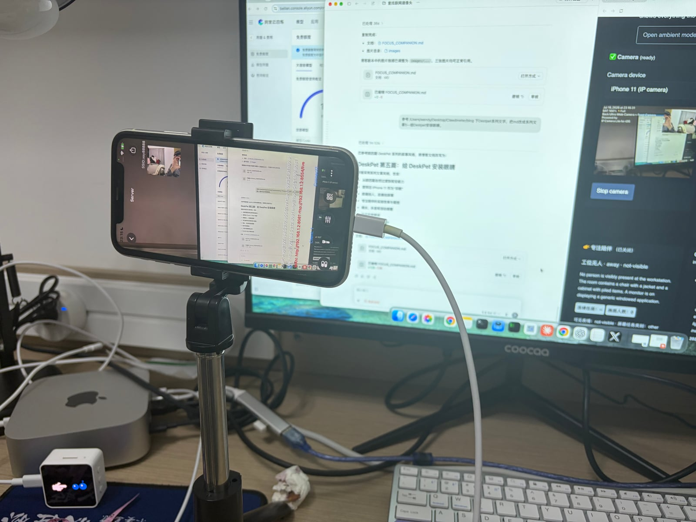
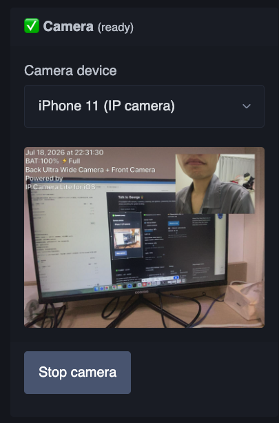
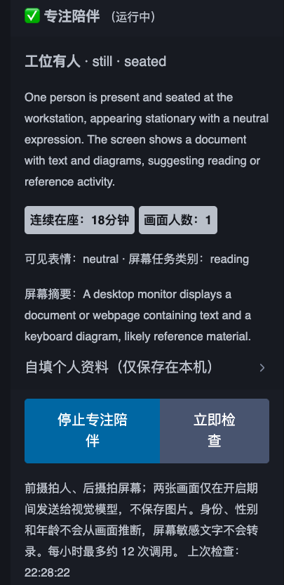
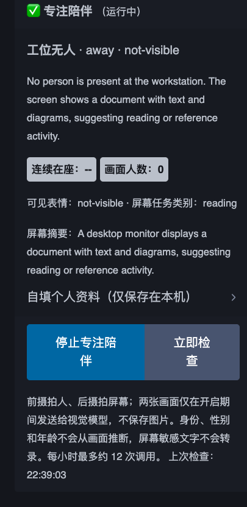

# DeskPet 第五篇：给桌宠装上一双眼睛

> 前几次升级让 DeskPet 会显示、会提醒、会控制台灯，也会听我说话。
> 这一次，我给它接上一台旧 iPhone，让它终于可以看见桌面上发生了什么。

---

## 从会说话到会看

前四篇里，DeskPet 的能力一直在往外扩：

- 最开始，它只是显示 Claude 用量、倒计时和时间
- 后来有了 Idle Nudge 和番茄钟，开始管理工作节奏
- 接入 Yeelight 之后，它能控制桌面的灯光
- 加上语音链路之后，它可以听懂命令并开口回答

但这些能力都有一个共同限制：DeskPet 不知道我现在是否坐在工位前，也不知道
电脑屏幕上正在做什么。

番茄钟可以告诉我「已经专注 25 分钟」，却不知道这 25 分钟里我是在写代码、
看文档，还是早就离开了桌子。Idle Nudge 根据 Claude 用量变化判断空闲，也不一定
等于人真的不在工位。

所以这次想做的事情很直接：**给 DeskPet 安装眼睛。**

其实，给 DeskPet 装上眼睛这个想法很早就有了。最初的计划，是直接给 ESP32
配一个摄像头模块，让摄像头成为桌宠硬件的一部分。但真正准备动手时，又开始纠结
该买哪一种：接口是否合适、画质够不够、视角要多广、能不能同时拍到人和屏幕，
还要考虑供电、布线和后续处理。选型迟迟定不下来，这个功能也就一路拖到了现在。

直到昨天，我突然意识到：为什么还要专门买一颗摄像头？抽屉里那台已经吃灰很久的
iPhone 11，本身就有前后摄像头、稳定的供电和现成的网络能力。与其让它继续闲着，
不如直接把它变成 DeskPet 的眼睛。

---

## 一台旧 iPhone 11，正好两只眼睛

iPhone 11 自带的两颗摄像头正好可以分工：

- **前置摄像头拍人**：判断工位是否有人、坐了多久、当前是活动还是静止
- **后置摄像头拍屏幕**：判断现在大致是在编码、阅读、看视频还是沟通

我把手机横放在桌面支架上，后摄对准显示器，前摄小窗则拍向座位。手机接上电源后，
就可以作为一只长期放在桌上的双目摄像头。



iPhone 上运行 IP Camera Lite，通过局域网输出 HTTP/MJPEG 视频流。它可以把
后摄主画面和前摄小窗合成到同一张画面里：



画面里，后摄对准桌上的显示器，前摄小窗对准使用者。这样一台旧手机就同时承担了
两路视觉输入，不需要额外购买 USB 摄像头，也不需要依赖 iPhone 镜像窗口。

---

## 把一张画面拆成两路视觉

IP Camera Lite 输出的是一张前后摄合成画面，但人物检测和屏幕分析需要分开处理。

电脑上的服务先从 MJPEG 流里取出最新 JPEG，然后使用 Sharp 做两次裁切：

1. 裁出前摄小窗，作为人物画面
2. 裁出后摄主画面，作为屏幕画面
3. 分别校正方向并压缩
4. 把两张图片标记为「人物视图」和「屏幕视图」
5. 一起交给阿里云百炼的 `qwen3.7-plus`

模型不会返回一段随意的描述，而是返回固定结构的数据：

```json
{
  "present": true,
  "personCount": 1,
  "activity": "still",
  "posture": "seated-working",
  "visibleExpression": "neutral",
  "screenActivity": "coding",
  "screenSummary": "A development environment is visible."
}
```

服务端再用 Zod 检查字段和枚举，只有格式正确的结果才会进入 DeskPet 的专注状态。

---

## 专注陪伴

有了两路视觉之后，我做了一块新的「专注陪伴」面板。

它每 5 分钟检查一次当前工位：

- 有没有人在桌前
- 画面里有几个人
- 当前是活动、静止还是已经离开
- 姿势是坐着工作、站立还是不可见
- 屏幕大致属于编码、阅读、视频或沟通
- 连续在座和连续静止已经持续多久

也可以随时点击「立即检查」，手动执行一次双摄分析。

### 工位有人

当我坐在桌前时，DeskPet 会开始累计连续在座时间，同时显示当前姿势、活动状态
和屏幕任务类别。



这张截图里，前摄识别到工位有人、当前较静止；后摄看到屏幕上是文档或参考资料，
所以把任务归为 `reading`。

### 工位无人

当我离开桌子，人物状态会变成 `away`，连续在座计时清空。后摄仍然可以独立判断
屏幕上正在显示什么类型的内容。



这比单纯依赖鼠标、键盘或 Claude 用量更接近真实状态：即使屏幕还亮着、程序还在运行，
DeskPet 也知道人已经不在桌前。

---

## 喝水、休息和活动提醒

专注陪伴不只是展示状态，它也会根据连续在座时间主动提醒：

- **连续在座 45 分钟**：提醒喝水
- **连续在座 50 分钟**：提醒起身、眺望远处、放松肩颈
- **连续静止 30 分钟**：提醒伸展肩颈和手腕
- **检测到离开工位**：清空当前在座和静止计时

提醒会直接显示在面板里。如果浏览器获得了通知权限，也可以弹出系统通知。

以前的番茄钟按照固定时间工作；现在的专注陪伴多了一层现场信息。DeskPet 不只知道
「时间到了」，还知道「这个人确实已经坐在这里很久了」。

---

## 实现简述

这次仍然沿用 DeskPet 一直以来的思路：硬件负责采集和交互，复杂逻辑留在电脑上。

- **iPhone 11**：提供前后摄像头画面
- **IP Camera Lite**：把画面转换成局域网 MJPEG 视频流
- **Node.js + Express**：代理摄像头、提供双图分析接口
- **Sharp**：裁切前摄人物和后摄屏幕区域，校正方向并压缩图片
- **阿里云百炼 `qwen3.7-plus`**：理解人物状态和屏幕任务
- **OpenAI JavaScript SDK**：通过百炼的 OpenAI 兼容接口调用模型
- **Zod**：验证模型返回的结构化 JSON
- **React + Zustand**：显示专注状态、累计时间并生成提醒
- **Notifications API**：发送喝水和休息通知

整个链路是：

```text
iPhone 双摄 -> MJPEG -> 本地裁切 -> 百炼视觉模型
-> 结构化状态 -> 在座计时 -> 喝水 / 休息 / 伸展提醒
```

默认检查间隔是 5 分钟，持续运行时每小时最多约 12 次视觉调用。百炼共
1,000,000 免费调用次数，足够先把这个功能跑起来。

---

## DeskPet 终于看见桌面了

这次升级之后，DeskPet 多了一种以前没有的输入。

它不再只能从 API 数字、按钮和语音里理解桌面状态。现在它能看见我是否坐在工位前，
能看见屏幕大致在做什么，也能根据真实的在座时间提醒我喝水和休息。

前几篇让 DeskPet 从用量屏变成桌宠，从桌宠变成桌面控制器，再变成可以听和说的
桌面伙伴。

第五篇之后，它终于有了眼睛。
