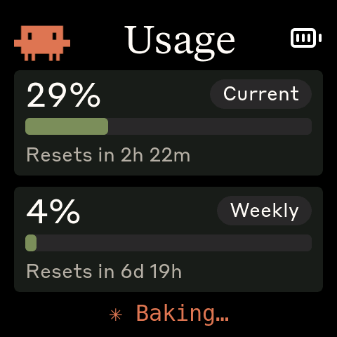
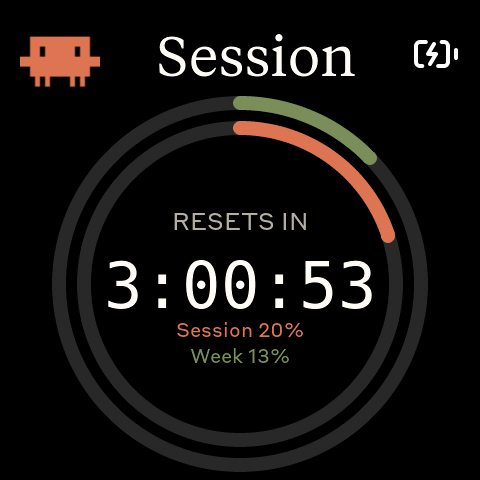
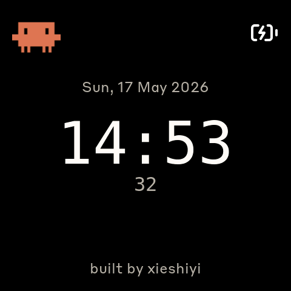

# 在桌上养一只宠物：CodePet 开发笔记

> 一块 480×480 的 AMOLED 小屏，放在桌上盯着我的 Claude Code 用量。
> 这篇记录一次开发会话——从把设备跑起来到加了三块新屏。

CodePet 跑在 **Waveshare ESP32-S3-Touch-AMOLED-2.16** 上：开发板
通过蓝牙和电脑上的守护进程配对，守护进程轮询 Anthropic API 拿用量
数据推到屏上。

---

## 把它跑起来

刷固件、蓝牙配对、装守护进程——环境上踩了几个坑（PlatformIO 的
Python 版本、macOS 的隐私保护、过期的 OAuth token），逐个绕过去就行，
这里不展开。搞定后，屏上终于显示了真实用量：

---

## 功能一：像素画 Clawd 动画

设备开机停在 splash 屏，循环播放像素画的 Clawd 小动画——这是它
「桌宠」气质的来源。

动画素材来自 claudepix,有十几种不同的 Clawd 造型。固件按用量的变化
率挑选动画分组，用得越猛动画越「忙」,而且每隔一段时间在同组里轮换，
不至于一直盯着同一只。

---

## 功能二：重置倒计时大屏

一块专门的**倒计时大屏**——中央一个超大数字，外面套着同心进度环。

几个值得一提的点：

- **等宽字体**：秒级跳动的倒计时如果用比例字体，数字宽度变化会让整串
  文字左右抖。所以专门生成了一个大号等宽字体。
- **本地走秒**：守护进程每 60 秒才推一次数据，但倒计时要每秒跳。做法
  是收到数据时记下「重置时刻」,之后每秒本地算差值，新数据到达时
  重新校准。
- **同心双环**：内环（陶土橙）按 session 用量百分比填充，外环（绿色）
  按 7 天 weekly 用量百分比填充。两条图例文字的颜色和各自的环对应。

---

## 功能三：时钟屏

再加一块**环境时钟屏**。

时间由守护进程带过来——BLE 的 JSON 协议扩了两个字段：当天秒数 `t`
和预格式化的日期串 `d`。固件拿到后本地走秒，每次轮询重新校准。
（板子自带 RTC,后续可以改成固件直接读 RTC,这样断连也不丢时间。）

时钟数字用了一个新的 96px 等宽大字体。

---

## 成果

这次会话给设备做出了几块屏：

- **Splash** —— 像素画 Clawd 动画
- **Usage** —— session / weekly 用量条
- **Countdown** —— 重置倒计时 + 同心进度环
- **Clock** —— 主机时间 + 日期

按中间键在 Usage → Countdown → Clock 间循环，点屏幕切回 splash 动画。

---

## 未来功能扩展

还有几个想做的方向：

- **用量趋势图**——新增一屏，用 sparkline 画出当天 session 用量的
  变化曲线，一眼看出什么时段烧得猛。
- **触顶警报**——当状态变成 `limited` 时全屏弹一只「沮丧」的 Clawd,
  比单看百分比更直观。
- **用量焦虑表情**——splash 动画按用量强度切换情绪：低用量悠闲打盹，
  高用量则换成更「慌」的动画。
- **更多桌宠互动**——利用板载的 IMU 和触摸做一些轻交互，让它更像
  一只活的桌宠而不只是个仪表盘。
