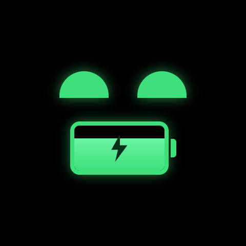
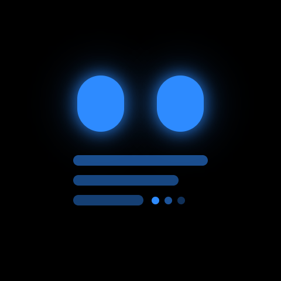

# DeskPet 第四篇：让桌宠开口说话

> 这次升级之后，DeskPet 不再只是一个会显示用量的小屏。
> 它有了新的形象，也开始成为桌面上的语音对话入口。

DeskPet 介绍线上网页：[https://deskpet.pages.dev](https://deskpet.pages.dev/)

---

## 从仪表盘到对话入口

前几篇里，DeskPet 的核心还是「看」：

- 看 Claude 用量
- 看倒计时和番茄钟
- 看台灯状态
- 看桌宠动画

这次升级之后，交互重心变了。现在按下左键，DeskPet 会进入语音对话：

1. 按下左键：进入 `Listening`
2. 松开左键：进入 `Transcribing`
3. 如果听到的是台灯命令：直接执行台灯操作
4. 如果是普通问题：调用 AI 生成回复
5. 回复播放完成：回到 `Idle`

也就是说，DeskPet 从「桌面仪表盘」变成了一个可以说话、可以听懂命令、
也能顺手控制桌面环境的小伙伴。

<video src="images/demo.MOV" controls muted playsinline width="480"></video>

---

## 新 Logo 和新形象

这次也重新做了 DeskPet 的形象。


新形象不再沿用旧的 Clawd 像素动画，而是换成一套 DeskPet 自己的状态动画。
开机页会轮流展示：

`idle -> happy -> sleepy -> curious -> angry -> love`

语音交互时则切换到更明确的工作状态：

- `listening`：正在听你说话
- `transcribing`：正在把语音转成文字
- `speaking`：正在回答
- `charging`：充电中
- `low-battery`：低电量

这套状态图的静态预览如下：

| Idle | Happy | Sleepy |
| :--: | :---: | :----: |
|  |  |  |

| Curious | Angry | Love |
| :-----: | :---: | :--: |
|  |  |  |

| Charging | Low Battery | Speaking |
| :------: | :---------: | :------: |
|  |  |  |

| Listening | Transcribing |
| :-------: | :----------: |
|  |  |

动画素材使用 MP4 管理，放在 `logo/DeskPet-mp4/`。生成脚本会把这些 MP4
转换成固件里的压缩动画数据，再由 ESP32 在 480×480 AMOLED 屏上播放。

这样做的好处是：后续换形象、换表情、加动作，都不需要手写像素数组。
只要替换 MP4，再重新生成固件资源即可。

---

## 语音链路

语音对话分成三段：

第一段是 **ESP32 录音**。DeskPet 使用开发板上的麦克风，把 PCM 音频通过
BLE 分片发给电脑上的 daemon。

第二段是 **语音转文字**。daemon 收到音频后包装成 WAV，调用阿里云
DashScope 的 ASR 模型：

```text
fun-asr-flash-2026-06-15
```

第三段是 **理解与回复**。如果转写结果像「把台灯调成柔和绿光」这样的命令，
daemon 会直接走 Yeelight 控制逻辑；如果不是台灯命令，就调用 DeepSeek
生成一个简短回复。

最后，回复文字再交给 DashScope TTS 播放：

```text
qwen3-tts-instruct-flash-realtime-2026-01-22
```

这条链路让 DeskPet 可以同时做两件事：

- 像遥控器一样控制台灯
- 像桌面助手一样回答问题

---

## 实现简述

整体架构仍然保持轻量：

- **ESP32**：负责屏幕、按钮、动画、麦克风采集和 BLE 传输
- **macOS daemon**：负责联网、ASR、DeepSeek、TTS、Yeelight 控制
- **DashScope ASR**：负责语音转文字
- **DeepSeek**：负责非台灯命令的智能回复
- **DashScope TTS**：负责把回复播放出来
- **Yeelight 智能彩色灯泡**：负责桌面灯光反馈

ESP32 不直接连大模型，也不直接控制台灯。它只做好本地交互，把复杂逻辑交给
电脑上的 daemon。这样硬件端保持稳定，模型和服务也更容易替换。

---

## 这次升级之后

DeskPet 现在已经不是单纯的 Claude 用量监控器了。

它有自己的形象，有开机动画，有语音状态，有台灯控制，也能在听不懂台灯命令时
认真回答你一句话。

从这一版开始，它更像一个真正放在桌上的小设备：平时安静待着，需要时听你说话，
能控制周围环境，也能用声音回应你。
