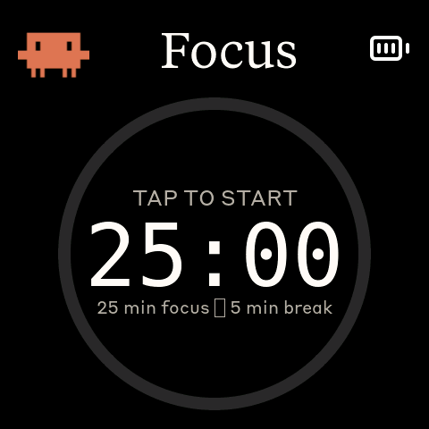

# Idle Nudge + 番茄钟——完整的工作节奏闭环

> DeskPet 新功能：桌宠催你干活，帮你专注，到点提醒你休息。

---

## 两个功能，一个闭环

**Idle Nudge** 催你「去干活」，**番茄钟** 催你「该休息」——两者
串联起来，构成完整的工作节奏：

1. 空闲太久 → 弹出 Nudge 催你回去写代码
2. 点击 Nudge → 打开 Claude，同时自动启动 25 分钟专注倒计时
3. 专注结束 → Clawd 跳庆祝舞，进入 5 分钟休息
4. 休息结束 → 如果你又开始偷懒，Nudge 重新接管

<!-- 录屏演示 -->
<!--  -->

---

## Idle Nudge——别闲着

当 session 用量百分比连续 5 分钟没有变化，设备自动弹出全屏覆盖层：

左边是经典鼠标指针手型，不停地左右晃动；右边是一只正在敲代码的
Clawd 像素动画。意思很明确：**点我，回去干活。**

轻触屏幕，设备通过 BLE 向主机发送指令，自动打开 Claude 应用，
覆盖层消失。如果你继续偷懒，它还会再弹出来——直到 session 数据
真正发生变化才停止催促。

---

## 番茄钟——专注与休息

点击 Nudge 不只是打开 Claude——同时启动一轮 25 分钟的专注计时。

屏幕中央是 MM:SS 大字倒计时，外面套着进度环。专注阶段环是橙色，
休息阶段切成绿色。

三个阶段自动流转：

- **Focus（25 分钟）**——进度环逐渐填满，倒计时每秒跳动
- **庆祝（5 秒）**——切到 splash 屏播放 Clawd 跳舞动画
- **Break（5 分钟）**——回到番茄钟屏，绿色环开始倒计时

番茄钟也可以手动启停：在番茄钟屏按中键启动，再按停止。专注期间
Nudge 自动禁用——你已经在干活了，桌宠不会再催你。

---

## 演示说明

> 为了录演示视频，Nudge 触发阈值从 5 分钟改成了 5 秒，番茄钟
> 从 25 分钟改成了 10 秒，休息从 5 分钟改成了 5 秒。

---

## 额度刷新推送——第一时间回来

Session 或 weekly 用量见顶后，你只能等额度重置。问题是：什么时候
重置的？不可能一直盯着屏幕刷。

现在守护进程会自动检测额度刷新——当 session 或 weekly 用量百分比
从非零回落到 0% 时，立即通过 Apple Reminders 向你的所有设备推送
通知：

技术实现很简单：守护进程每 60 秒轮询一次 API，记录上一次的用量
百分比。一旦检测到 >0% → 0% 的跳变，调用 AppleScript 在默认提醒
列表创建一条高优先级、立即到期的提醒。iCloud 会在几秒内把这条
提醒同步到 iPhone、iPad、Apple Watch——无论你在哪里，都能第一
时间知道额度恢复了。

这和 Idle Nudge 形成了另一个闭环：

1. 额度用完 → 被迫停工
2. 额度刷新 → 手机收到推送
3. 回到电脑 → 如果发呆太久，Nudge 弹出来催你
4. 点击 Nudge → 打开 Claude，开始新一轮专注

---

如果你对 DeskPet 有任何建议或新功能 idea，欢迎在评论区留言！
