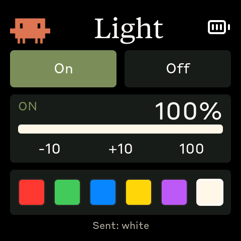

# DeskPet 第三篇：把桌上的台灯也接进来

> DeskPet 不只是盯着 Claude 用量了。
> 这次给它加了一块 Light 触控页，还让台灯跟着工作节奏一起变化。

---

## 从一个 Python 小实验开始

这盏台灯来自 Yeelight 智能彩色灯泡。最开始验证它很简单，几行 Python 就能跑通：

```python
from yeelight import Bulb

bulb = Bulb("192.168.5.117")
bulb.turn_on()
bulb.turn_off()
bulb.set_brightness(50)
```

这说明台灯本身没问题，局域网也通。真正的问题变成了：**怎么把这个能力
放进 DeskPet 的触摸屏里？**

我不想让 ESP32 直接连 Wi-Fi 去控制台灯。现在 DeskPet 的架构已经很清楚：
小屏负责交互和显示，电脑上的 daemon 负责联网、拿 API 数据、执行主机侧
动作。台灯也应该走同一条路：

1. 手指点屏幕
2. ESP32 通过 BLE 发一个小命令
3. macOS daemon 收到命令
4. daemon 调用 `yeelight` 控制台灯

这样 DeskPet 仍然是一只轻量的桌面小宠物，复杂的联网逻辑都留在电脑上。

---

## Light 触控页

新页面长这样：



<!-- 视频演示占位：后续替换为真实录屏文件 -->
<!--
<video src="images/light-control-demo.mp4" controls muted playsinline width="480"></video>
-->

上面是最直接的开关：**On / Off**。

中间是亮度区：

- 当前状态：`ON` / `OFF`
- 当前亮度百分比
- 一条跟随当前颜色变化的亮度条
- `-10`、`+10`、`100` 三个大按钮

下面是一排颜色色块：红、绿、蓝、黄、紫、暖白。这里没有用文字列表，
而是直接用大色块做触摸目标。选中的颜色会出现白色描边，亮度条也会变成
对应颜色。

这个页面刻意做得很「粗」：按钮大、间距大、没有复杂滑杆。2.16 英寸的小屏
放在桌上，手指点上去应该是毫不费力的，而不是像在手机设置页里抠小控件。

---

## 实现简述

实现上沿用 DeskPet 现有架构：ESP32 负责触摸界面，macOS daemon 负责
真正控制台灯。

触摸页把开关、亮度、颜色操作转换成 BLE 命令发给电脑。daemon 收到后，
用 `yeelight` 连接 `192.168.5.117`，分别调用 `turn_on()`、`turn_off()`、
`set_brightness()` 和 `set_rgb()`。

这样 ESP32 不需要直接连 Wi-Fi，也不用处理台灯协议；它只保持一个轻量、
稳定的交互入口。

后面做自动联动时，又加了两个更高层的台灯指令：一个是 scene，一次性设置
亮度和颜色；另一个是 alert，用来做红色闪烁并恢复原来的台灯状态。这样
番茄钟和额度提醒不用连续发送多条细碎命令，表现会更稳。

---

## Claude 状态台灯

顺手又把 Claude Code 的 hooks 接进了这盏台灯。它不只响应触摸屏，也能反映
Claude 当前在做什么：

- 红色：Claude 正在工作或执行工具
- 黄色：Claude 等待确认、授权或输入
- 绿色：任务完成

实现方式很小：Claude hook 调一个本地 Python 脚本，脚本再通过 `yeelight`
给 `192.168.5.117` 设置颜色。这样不用改 Claude 本身，也不用让 DeskPet
参与判断，只是把「AI 当前状态」翻译成桌面光线。

---

## 自动场景联动

手动控制解决的是「我想调台灯」；自动联动解决的是「DeskPet 主动调气氛」。

现在台灯会跟着几种桌面状态变化：

- **专注开始**：自动切成暖白高亮，像给桌面打开一盏工作台灯
- **进入休息**：自动切成柔和绿光，让节奏从紧绷切到放松
- **休息结束或停止番茄钟**：回到低亮暖白，不打扰接下来的工作
- **额度用完**：闪一下红色，再恢复原来的台灯状态

这个联动没有把台灯逻辑塞进 ESP32。小屏仍然只是判断当前状态，然后通过 BLE
告诉 daemon：「现在该切到某个场景了。」真正的台灯连接、颜色设置、红闪恢复
都在电脑上完成。

---

## DeskPet 开始碰到现实世界

前两篇里，DeskPet 主要还是「显示」和「提醒」：

- 显示 Claude 用量
- 显示倒计时和时钟
- 空闲时催你回来
- 到点提醒你休息

Light 功能不一样。它让 DeskPet 第一次开始控制桌面环境本身。

这只小屏不再只是告诉我「你用了多少 Claude」，也不只是提醒我「该工作了」。
它现在可以顺手把台灯调亮、调暗、换成暖白或蓝色；也会在专注、休息和额度
见顶时，主动把桌面光线切到对应气氛。

这一步之后，DeskPet 就不只是一个监控器了。屏幕里的桌宠、电脑上的 daemon、
桌上的台灯，开始组成一套会呼吸的桌面仪式。
